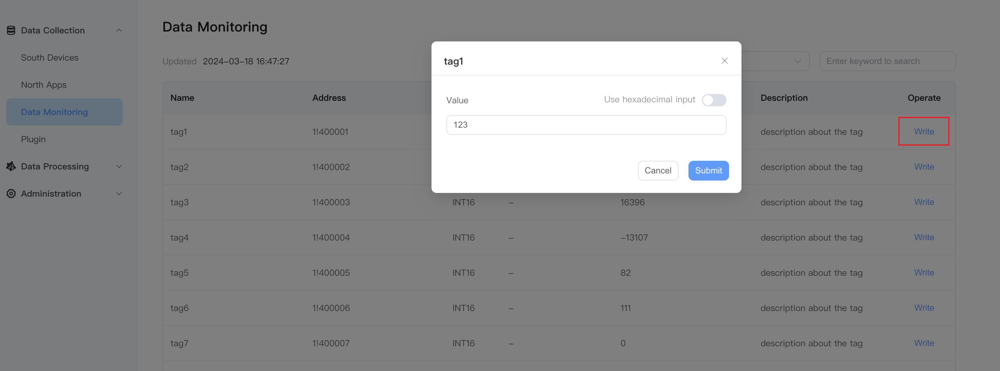

# Data monitoring

## Data monitoring dashboard

Click `Data Monitoring` on the left, select the southbound device and group name, and view the point values.

* Southbound device: Select the southbound device you want to view, for example, select the created device modbus-tcp-1;
* Group name: Select the group under the southbound device you want to view, for example, select the created group group-1;
* Data monitoring displays values in groups, and the page will display the read value of each tag in the group.

## Control device

NeuronEX provides the ability to control device through southbound drivers. Instructions can be issued to the device through the following various channels:

- Data stream processing module for NeuronEX
- Other third-party applications
- IIoT platform
- Cloud platform applications

There are three ways to send commands to the device:
- Users can write data to device on [Dashboard Monitoring Screen](#data-monitoring-dashboard).
- Users can write data to device via [RESTful APIs](https://docs.emqx.com/zh/neuronex/latest/api/api-docs.html#tag/rw).
- [MQTT data downstream channel](../configuration/north-apps/mqtt/api.md) . Any external system, such as a cloud-based platform, can publish command data to a specific MQTT topic, and NeuronEX receives the command data and sends it to the device.

### Monitoring dashboard data writing

When the point has a write attribute, the Tag on the data monitoring interface will have a write operation. Click `Write` to realize reverse control of the device. For example, modify the value of the 1!40001 point address with write attribute, as shown in the figure below.

* Click the `Write` button at the end of the tag whose value you want to change;
* Select whether to input in hexadecimal mode, or not;
* Enter the new value of the label, for example, 123;
* Click the `Submit` button to submit the new value.

::: tip
This point in the device must also have a writable attribute, otherwise the writing cannot be successful.
:::

### Check whether the device point value is modified successfully

Open the Modbus simulator and check whether the point value changes, as shown in the figure below.

