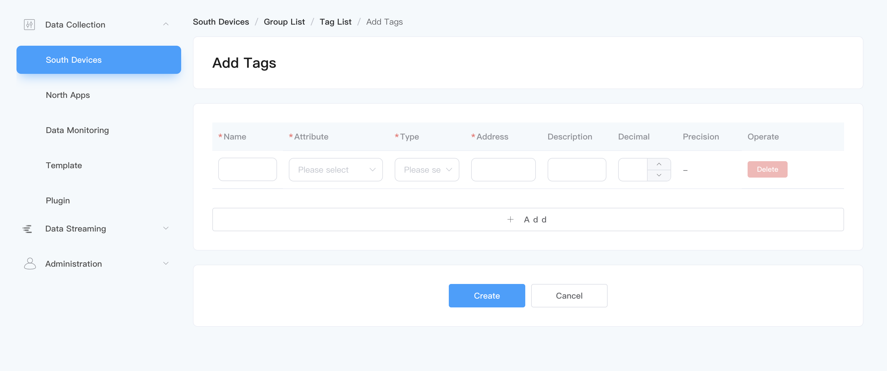

# Establish device communication

 Points will be assigned to groups. Each group has an independent polling frequency to read data from the device. To establish communication between the device and NeuronEX, first add the group and point for the southbound driver. Once the group and point are created, the real-time value of the point can be obtained from data monitoring.

## Create a group in the device card

Create point groups, and data in the same group will be collected and reported at the same frequency.

Click the newly added device node to enter the group list management interface, and click `Create` to create the group.

* Name: Fill in the name of the group, such as group-1.
* Interval: The collection and reporting frequency of this group of points, in milliseconds, 100 means collecting once every 100ms, and the value of the entire group of points is reported once.


## Add collection data points to the group

Add the data points that need to be collected, including point addresses, point attributes, data types, etc.

Click the `Tag List` icon in the group to enter the Tag List management interface.

Click the `Create` button to enter the add tag page, as shown in the figure below.



* Name: fill in the Tag name, for example, tag1;
* Attributes: Pull down to select Tag attributes, such as read, write, subscribe, static, and support the configuration of multiple point types. For an introduction to different types of points, see [Point Attributes] (#Point Attributes);
* Type: drop-down to select data type, for example, int16, uint16, int32, uint32, float, bit;
* Address: Fill in the driver address, for example, 1!40001. 1 represents the point site number set in the Modbus simulator, 40001 represents the point register address. For detailed instructions on using the driver address, please refer to [Modbus Introduction and Use](.. /south-devices/modbus-tcp/modbus-tcp.md);
* Multiplication coefficient: not filled in by default; when the point attribute is write, it supports setting the multiplication coefficient. At this time, `device value * multiplication coefficient = display value`, if the point multiplication coefficient value is 0.1, write the display value on the page, For example, if 23.4 is used, the value displayed on the page is 23.4, and the value written to the device is 234.
* Accuracy: Configure the accuracy when the point type is `float` or `double`, the accuracy range is 0 ~ 17
* Description: Leave blank by default.

### Point attributes

There are three types of points: read, write and subscribe.

- Read (read) and write (write) type points are used to read data and write data respectively.

- Subscribing to a point will only send messages when the data changes, and will not send messages when there are no changes. For example, the default data is 0, when the data is changed to 2, a message will be sent. 

After the point creation is completed, the working status of the device card is **Running**, and the connection status should be **Connected**. If the connection status is still **Not Connected** at this time, please first execute the following command on the ECP Edge running environment terminal to confirm whether the ECP Edge running environment can access the corresponding IP and port:

```bash
$ telnet <IP of the PC running the Modbus simulator> 502
```

Please confirm that the IP and Port are set correctly during device configuration and the firewall is turned off.