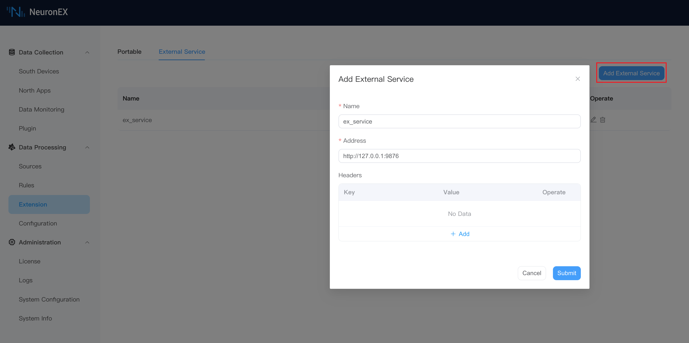

# extension

NeuronEX allows users to customize extensions to support more functions. Users can write extension plugins through the portable plugin system, or call existing external REST services.


## Portable plugin extension

You can further expand the functionality of NeuronEX by installing portable plugins. Customized **data sources**, **custom functions** and **actions (Sink)** in rules can be implemented through convenient plugins.

Click **Data Processing** -> **Extensions**, on the **Portable Plugins** tab, click **Create Portable Plugins**. In the pop-up window, make the following settings:

- **Name**: Select or enter the plugin name
- **File**: Paste the plugin file by uploading or text box.

After completing the above settings, click **Submit** to complete the creation of the plugin. The new plugin will appear in the plugin list on this page, and you can view or delete the plugin here.

## Portable plugin development

The development plugin consists of sub-modules and main programs. The Python SDK provides the source, target and function API of the python language.

Source interface:

```python
   class Source(object):
     """abstract class for eKuiper source plugin"""

     @abstractmethod
     def configure(self, datasource: str, conf: dict):
         """configure with the string datasource and conf map and raise error if any"""
         pass

     @abstractmethod
     def open(self, ctx: Context):
         """run continuously and send out the data or error with ctx"""
         pass

     @abstractmethod
     def close(self, ctx: Context):
         """stop running and clean up"""
         pass
```

Sink interface:

```python
class Sink(object):
     """abstract class for eKuiper sink plugin"""

     @abstractmethod
     def configure(self, conf: dict):
         """configure with conf map and raise error if any"""
         pass

     @abstractmethod
     def open(self, ctx: Context):
         """open connection and wait to receive data"""
         pass

     @abstractmethod
     def collect(self, ctx: Context, data: Any):
         """callback to deal with received data"""
         pass

     @abstractmethod
     def close(self, ctx: Context):
         """stop running and clean up"""
         pass
```

Function interface:

```python
class Function(object):
     """abstract class for eKuiper function plugin"""

     @abstractmethod
     def validate(self, args: List[Any]):
         """callback to validate against ast args, return a string error or empty string"""
         pass

     @abstractmethod
     def exec(self, args: List[Any], ctx: Context) -> Any:
         """callback to do execution, return result"""
         pass

     @abstractmethod
     def is_aggregate(self):
         """callback to check if function is for aggregation, return bool"""
         pass
```

Users create their own sources, Sinks and functions by implementing these abstract interfaces, and then declare the instantiation methods of these custom plugins in the main function

```python
if __name__ == '__main__':
     c = PluginConfig("pysam", {"pyjson": lambda: PyJson()}, {"print": lambda: PrintSink()},
                      {"revert": lambda: revertIns})
     plugin.start(c)
```

## Portable plugin development example

Portable plugin extensions currently support plugin extensions via the **Python** and **Golang** programming languages. For specific plugin writing methods, please refer to:

- [Python portable plugin example](portable_python.md)


## External algorithm function 

The external algorithm function, also called the external service, refers to mapping an existing external HTTP service to a SQL function of NeuronEX. When using external service in rules, the data from source will be passed to the external service, and the calculation result of the external service will be returned to NeuronEX for output.

To use an external service, just follow these 2 steps:
- [Create an external service](#create-an-external-service)
- [Use external services in rules](#using-external-service-in-rules)

### Create an external service

Click **Data Processing** -> **Extensions**, on the **External Service** tab, click **Add External Service**.

- **Name**: Enter the external service name, which will be used in SQL. Please enter    characters and numbers;
- **Address**: The service address of the external service, only includes `http://[ip]:[port]`, and the service suffix is filled in SQL;
- **Headers**: Optional, headers information of external services.



### Using external service in rules

Enter the following in the rule:


`ex_service("post","/api/test1", *)` means that all data from `neuronStream` will be sent to the HTTP Server address `http://127.0.0.1:9876/api/test1` through the HTTP POST method, and the processing result of external service will be sent to Sink.

### Example of external algorithm function

Please refer to [External Algorithm Function Example](./ex_func.md).