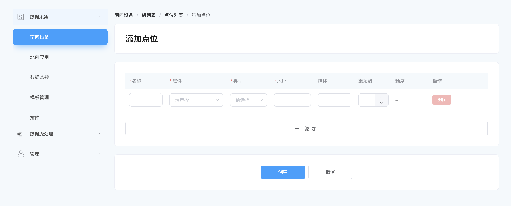

# 连接南向设备

数据点位是描述设备内数据的存储位置、操作属性和元数据的描述符，有助于用户访问和操作数据。数据点位定义了设备中的数据存储位置和数据操作属性，还包含有关数据的一些元数据信息，如缩放、精确度和读/写属性等。

点位将被分配到组中,每个组都有独立的轮询频率以从设备中读取数据。要建立设备与 NeuronEX 之间的通信，首先为南向驱动程序添加组和点位。创建好组和点位，即可从数据监控中获取点位的实时值。

## 在设备卡片中创建组

创建点位组，同一个组的数据以相同的频率进行采集以及上报。

点击新增的设备节点，进入组列表管理界面，点击 `创建` 来创建组。

* **名称**：填入组的名称，比如 group-1。
* **时间间隔**：这组点位的采集和上报频率，以毫秒为单位，100 表示每 100ms 采集一次，整组点位的值上报一次。


## 在组中添加采集数据点

添加需要采集的设备点位，包括点位地址，点位属性，数据类型等。

点击组中的 `Tag 列表` 图标，进入 Tag 列表管理界面。

点击 `创建` 按键，进入添加标签页面，如下图所示。



* **名称**：填写 Tag 名称，例如，tag1；
* **属性**：下拉选择 Tag 属性，例如，read，write，subscribe，支持配置多个点位类型。关于不同类型点位的介绍，见[点位属性](#点位属性)；
* **类型**：下拉选择数据类型，例如，int16，uint16，int32，uint32，float，bit；
* **地址**：填写点位地址，不同的驱动协议有的不同的地址定义规范，具体请参考[创建南向驱动](../south-devices/south-devices.md)。以Modbus协议为例，1!40001。1 代表 Modbus 模拟器中设置的点位站点号，40001 代表点位寄存器地址。 
* **乘系数**：默认不填；当点位属性为 read 时，支持设置乘系数，此时 `设备原始值 * 乘系数 = 上报值`。
* **精度**：点位类型选择 `float` 或 `double` 时配置精度，精度范围为 0 ～17
* **描述**：默认不填。

### 点位属性

点位共包括读（read），写（write）和订阅（subscribe）三种类型。

- 读（read）和写（write）类型点位分别用于读取数据和写入数据。

- 订阅（subscribe）点位则仅会在数据变化时上报数据，无变化时不上报数据。例如，默认数据为 0，当该数据改为 2 时，则将发送一条消息。如在 MQTTX 中订阅主题并查看，则将如下图所示。

  


点位创建完成后，设备卡片的工作状态处于 **运行中**，连接状态应处于 **已连接**。若此时连接状态仍然处于 **未连接** 的状态，请检查 NeuronEX 软件与设备之间的网络连通性，如果NeuronEX与设备之间是以太网通讯方式，执行以下指令，以确认 NeuronEX 运行环境能否访问到到对应的 IP 及端口：

```bash
$ telnet <设备端的 IP> Port
```

请您确认在设备配置时 IP 与 Port 正确设置，防火墙关闭。
