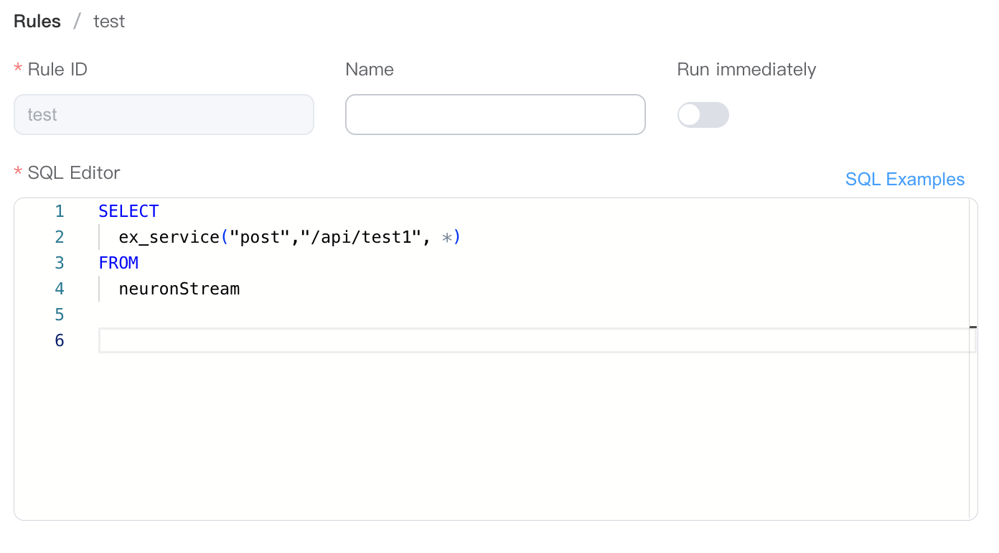

# 算法集成

NeuronEX 允许用户自定义算法集成，以支持更多功能。 用户可以通过便携插件系统编写扩展插件，也可以调用外部已有的 REST 服务。


## 便携插件

您可通过安装便携插件进一步拓展 NeuronEX 的功能。通过便捷插件可以实现自定义的**数据源(Source)**、规则中的**自定义函数**以及**动作(Sink)**。

点击**数据处理** -> **算法集成**，在**便携插件**页签，点击**创建便携插件**。在弹出的窗口，进行如下设置：

- **名称**：选择或输入插件名称
- **文件**：通过上传或者文本框的形式贴入插件文件。

完成上述设置后，点击**提交**完成插件的创建。新建插件将出现在该页面的插件列表中，您可以在此查看或者删除插件。

## 便携插件开发

开发插件包括子模块和主程序两部分, Python SDK 提供了 python 语言的源，目标和函数 API。

源接口:

```python
  class Source(object):
    """abstract class for eKuiper source plugin"""

    @abstractmethod
    def configure(self, datasource: str, conf: dict):
        """configure with the string datasource and conf map and raise error if any"""
        pass

    @abstractmethod
    def open(self, ctx: Context):
        """run continuously and send out the data or error with ctx"""
        pass

    @abstractmethod
    def close(self, ctx: Context):
        """stop running and clean up"""
        pass
```

目标接口:

```python
class Sink(object):
    """abstract class for eKuiper sink plugin"""

    @abstractmethod
    def configure(self, conf: dict):
        """configure with conf map and raise error if any"""
        pass

    @abstractmethod
    def open(self, ctx: Context):
        """open connection and wait to receive data"""
        pass

    @abstractmethod
    def collect(self, ctx: Context, data: Any):
        """callback to deal with received data"""
        pass

    @abstractmethod
    def close(self, ctx: Context):
        """stop running and clean up"""
        pass
```

函数接口:

```python
class Function(object):
    """abstract class for eKuiper function plugin"""

    @abstractmethod
    def validate(self, args: List[Any]):
        """callback to validate against ast args, return a string error or empty string"""
        pass

    @abstractmethod
    def exec(self, args: List[Any], ctx: Context) -> Any:
        """callback to do execution, return result"""
        pass

    @abstractmethod
    def is_aggregate(self):
        """callback to check if function is for aggregation, return bool"""
        pass
```

用户通过实现这些抽象接口来创建自己的源，目标和函数，然后在主函数中声明这些自定义插件的实例化方法

```python
if __name__ == '__main__':
    c = PluginConfig("pysam", {"pyjson": lambda: PyJson()}, {"print": lambda: PrintSink()},
                     {"revert": lambda: revertIns})
    plugin.start(c)
```

## 便携插件开发示例

便携插件目前支持通过 **Python** 和 **Golang** 编程语言进行插件开发。具体的插件编写方法，请参考：

- [Python 便携插件示例](portable_python.md)

## 外部算法函数

外部算法函数，即外部服务，是指将外部已有的一个 HTTP 服务，映射为 NeuronEX 的一个 SQL 函数。在规则中使用外部函数时，会将数据源中的数据传递给外部服务，并将外部服务的计算结果返回到 NeuronEX 并做输出。

使用外部服务，只需以下 2 个 步骤：
- [创建一个外部服务](#创建一个外部服务)
- [在规则中使用外部服务](#在规则中使用外部服务)

### 创建一个外部服务

点击**数据处理** -> **算法集成**，在**外部服务**页签，点击**添加外部服务**。

- **名称**：输入外部服务名称，该名称会在 SQL 中使用，请输入英文字符及数字；
- **服务地址**：外部服务的服务地址，只包括`http://[ip]:[port]`即可，服务后缀在 SQL 中填写；
- **Headers**：可选，外部服务的 Headers 信息。


### 在规则中使用外部服务

在规则中输入如下内容：



`ex_service("post","/api/test1", *)` 表示，会通过 HTTP POST 方法发送数据流 neuronStream 中的所有数据到 HTTP Server地址 `http://127.0.0.1:9876/api/test1` ,并将收到的外部服务的处理结果发送到 Sink 中。

### 外部算法函数示例

请查阅[外部算法函数示例](./ex_func.md)。


<!-- ## 外部函数扩展

外部函数扩展，即外部服务，是指通过提供一种配置的方式，使得 NeuronEX 可以使用 SQL 以函数的方式直接调用外部服务，包括各种 rpc 服务、 http 服务等。该方式将可大大提高 NeuronEX 扩展的易用性。外部函数将作为插件系统的补充，仅在性能要求较高的情况下才建议使用插件。

以 getFeature 函数为例，假设有 AI 服务基于 grpc 提供 getFeature 服务。则可在 NeuronEX 配置之后，使用 `SELECT getFeature(self) from demo` 的方式，无需定制插件，即可调用该 AI 服务。

详细配置方法，请参考[外部服务](./external_func.md)。

当用户已经导出服务并且不想编写代码时，外部服务功能可以轻松实现 SQL 函数的批量扩展。

### 外部函数列表

外部函数通过注册外部服务配置的方式，将已有的服务映射成 eKuiper SQL 函数。运行使用外部函数的规则时，eKuiper 将根据配置，对数据输入输出进行转换，并调用对应的服务。用户通过**外部服务**页签注册外部服务后，函数将出现在**外部函数列表**页。

## 插件对比

让我们对这 3 种方法进行一些比较。 在下表中，*动态重载* 表示插件是否可以在运行时更新或删除。 *更新时重建* 表示更新主程序时是否需要重建插件。 如果是，版本更新将变得复杂。 *独立进程* 意味着插件是否独立于主程序运行。 如果是，插件崩溃不会影响主程序。 *通信* 表示主程序和插件之间如何进行通信。内存通信是最有效的方法，要求主程序和插件在同一个进程中运行。 IPC （进程间通信）需要在同一台机器上运行，具有中等的性能和依赖性。 Web 通信是指通过 TCP 等 Web 协议进行通信，可以在不同的机器上运行。

| 扩展 | 扩展类型             | 需要编码？ | 语言             | 操作系统              | 动态重载 | 更新时重建? | 独立进程? | 通信     |
| ---- | -------------------- | ---------- | ---------------- | --------------------- | -------- | ----------- | --------- | -------- |
| 原生 | 源<br>目标<br/>函数  | 是         | Go               | Linux, FreeBSD, MacOs | 否       | 是          | 否        | 内存通信 |
| 便捷 | 源<br/>目标<br/>函数 | 是         | Go, Python ，... | 任意                  | 是       | 否          | 是        | IPC      |
| 外部 | 函数                 | 否         | JSON, protobuf   | 任意                  | 是       | 否          | 是        | Web      |

## 安装插件

您可通过安装插件进一步拓展 NeuronEX 的功能。

点击**数据处理** -> **扩展**，在**插件**页签，点击**创建插件**。在弹出的窗口，进行如下设置：

**类型**：选择要创建的插件类型，可选值：sources、sinks、functions

**名称**：选择或输入插件名称

**文件**：通过上传或者文本框的形式贴如插件文件。

**脚本参数**：输入安装插件脚本额外需要的参数配置，输入新条目后，按下回车键即可完成条目的添加。

完成上述设置后，点击**提交**完成插件的创建。新建插件将出现在该页面的插件列表中，您可以在此查看或者删除插件。关于 NeuronEX 目前支持以下类型的扩展：

- [数据源](./source.md)：为 NeuronEX 添加新的源类型，以便从中获取数据。新的扩展源可以在流/表定义中使用。
- [数据汇](./sink/sink.md)：为  NeuronEX 增加新的 sink 类型来发送数据。新的扩展 sink 可以在规则动作定义中使用。
- 函数：为 NeuronEX 添加新的函数类型来处理数据。新的扩展函数可以在规则 SQL 中使用。 -->
