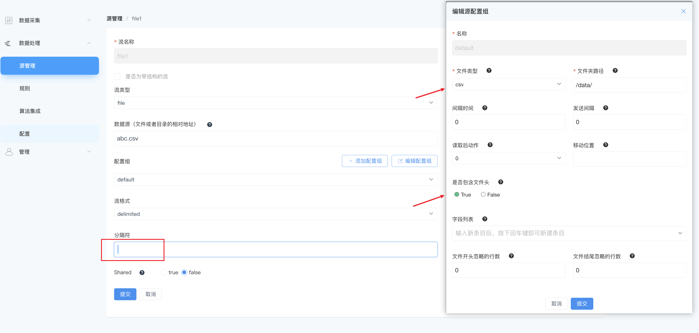
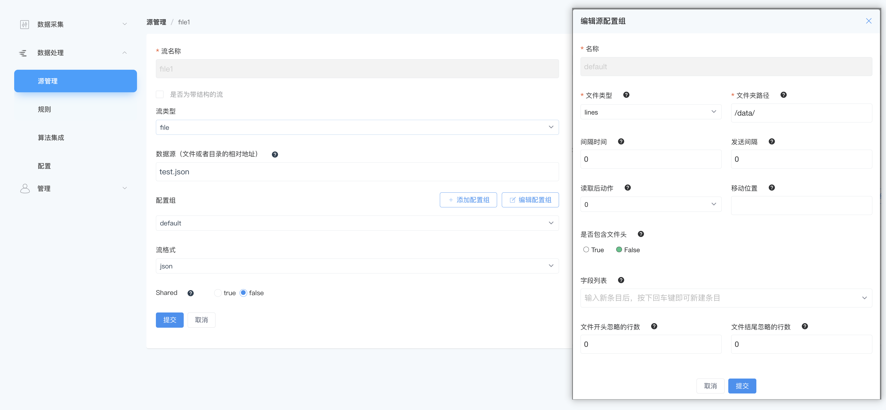

# 文件（File）

<span style="background:green;color:white;">流</span>        <span style="background:green;color:white">扫描表</span>


NeuronEX 数据处理模块通过 `File` 类型的数据源，可以接收来自文件的数据。File 类型可以作为流、扫描表的数据源，支持监控文件或文件夹。当监控对象为文件夹时，NeuronEX 会按照文件名的字母顺序来读取文件。

::: tip
如果被监控的位置是一个文件夹，该文件夹内的文件类型必须相同。
:::

支持的 File 类型：

- json：标准的JSON数组格式文件。如果文件格式是一个以行分隔的JSON字符串，它需要以 `lines` 格式定义
- csv：支持逗号分隔的 csv 文件，也支持自定义分隔符
- lines：以行分隔的文件。每行的解码方法可以通过流定义中的 `format` 参数来定义。例如，对于一个按行分隔的 JSON 字符串文件，文件类型应设置为 `lines`，格式应设置为 `json`，表示单行的格式为 JSON。

有些文件可能有大部分数据是标准格式，但在文件的开头和结尾行有一些元数据。用户可以使用 **文件开头忽略的行数**（`ignoreStartLines`） 和 文件结尾忽略的行数 (`ignoreEndLines`) 参数来删除非标准的开头和结尾的非标准部分，以便解析上述文件类型。

<!-- ## 准备文件

登录 NeuronEX，点击**数据流处理** -> **配置** -> **文件管理**，点击**创建文件**按钮。

NeuronEX 目前支持两种方式上传配置文件：上传文件或者提供文件名和文本内容。如选择**自定义文件**，请在文件名称处同时提供文件名和后缀，如 `my.json`，随后在文件内容处通过上传或者直接贴入文件内容。

点击**提交**后，文件将出现在**文件管理**页面的列表中，名称包含该文件的路径和文件名，如：

```
/opt/neuron/ekuiper/data/uploads/my.json
``` -->

## 创建流

登录 NeuronEX，点击**数据流处理** -> **源管理**。在**流管理**页签，点击**创建流**。

在弹出的**源管理** / **创建**页面，进入如下配置：

- **流名称**：输入流名称
- **是否为带结构的流**：勾选确认是否为带结构的流，如为带结构的流，则需进一步添加流字段。可默认不勾选。
- **流类型**：选择 file。
- **数据源**：指定文件或目录的相对地址。注：请输入不含路径的文件名，例如 `my.json`。
- **配置组**：可使用默认配置组，如希望自定义配置组，可点击添加配置组按钮，在弹出的对话框中进行如下设置，设置完成后，可点击**测试连接**进行测试：
  - **名称**：必填项，输入配置组名称。
  - **文件类型**：定义了文件的类型，可以是 json、csv 或 lines。
  - **文件夹路径**：必填项，文件所在文件夹的路径。但这里不应包含文件名，文件名应数据源字段中定义。例如 `data/uploads`
  - **间隔时间**：读取文件的时间间隔，单位为毫秒。如果设置为 0，则只读取一次。
  - **发送间隔**：事件发送的时间间隔，单位为毫秒。
  - **读取后动作**：文件读取后的操作。可以选择 0（保留文件）、1（删除文件）或 2（移动文件到另一个位置）。
  - **移动位置**：如果读取后动作设置为 2（移动文件），在此处定义了文件移动到的目标位置。
  - **是否包含头文件**：对于csv文件，定义是否有文件头。如果设置为 **True**，那么文件的第一行将被解析为文件头。
  - **字段列表**：在这里定义文件的列，如果定义了文件头，将覆盖此处的设置。
  - **文件开头忽略的行数**：忽略文件开头的几行。例如，如果设置为 3，那么文件的前三行将被忽略。
  - **文件结尾忽略的行数**: 忽略文件结尾的几行。注意，文件的最后空行不计算在内。
- **流格式**：支持 json、binary、protobuf、delimited、custom。

- **共享**：勾选确认是否共享源。

## 创建扫描表

File 源支持扫描表。登录 NeuronEX，点击**数据流处理** -> **源管理**。在**扫描表**页签，点击**创建扫描表**。

- **表名称**：输入表名称
- **是否为带结构的表**：勾选确认是否为带结构的表，如为带结构的表，则需进一步添加表字段。可默认不勾选。
- **表类型**：选择 file。
- **数据源**：指定文件或目录的相对地址。注：请输入不含路径的文件名，例如 test.json。
- **配置组**：可使用默认配置组，如希望自定义配置组，可参考[创建流](#创建流)部分
- **表格式**：支持 json、binary、delimited、custom。
- **保留大小**：指定表快照的大小，用于存储历史数据。


## 示例

文件源涉及对文件内容的解析，同时解析格式与数据流中的格式定义相关。我们用一些例子来描述如何结合文件类型和格式设置来解析文件源。

### 读取自定义分隔符的 CSV 文件

标准的 csv 文件，分隔符是一个逗号，但是有大量的文件使用类 csv 格式，但使用自定义的分隔符。另外，一些类 csv 的文件在第一行定义了列名，而不是数据，如下例所示。

```csv
id name age
1 John 56
2 Jane 34
```

该文件第一行为文件头，定义了文件的列名。读取这样的文件时，配置文件如下，需要指定文件有一个头。

在流定义中，将流数据设置为 `DELIMITED` 格式，用 `DELIMITER` 参数指定分隔符为空格。



通过以上命令，我们创建了一个名为 file1 的流，该流将从 abc.csv 文件中读取数据，预期分隔符为空格。

::: tip 注意
  在分隔符配置项中，需要输入空格。
:::

### 读取多行 JSON 数据

对于一个标准的 JSON 文件，整个文件应该是一个 JSON 对象或一个数组。在实践中，我们经常需要解析包含多个 JSON 对象的文件。这些文件实际上本身不是合法的 JSON 格式，但每行都是合法的 JSON 格式，可认为是多行JSON数据。

```text
{"id": 1, "name": "John Doe"}
{"id": 2, "name": "Jane Doe"}
{"id": 3, "name": "John Smith"}
```

读取这种格式的文件时，配置中的文件类型设置为 `lines`，流格式设置为`JSON`格式。




此外，lines 文件类型可以与任何格式相结合。例如，如果你将格式设置为 protobuf，并且配置模式，它可以用来解析包含多个 Protobuf 编码行的数据。