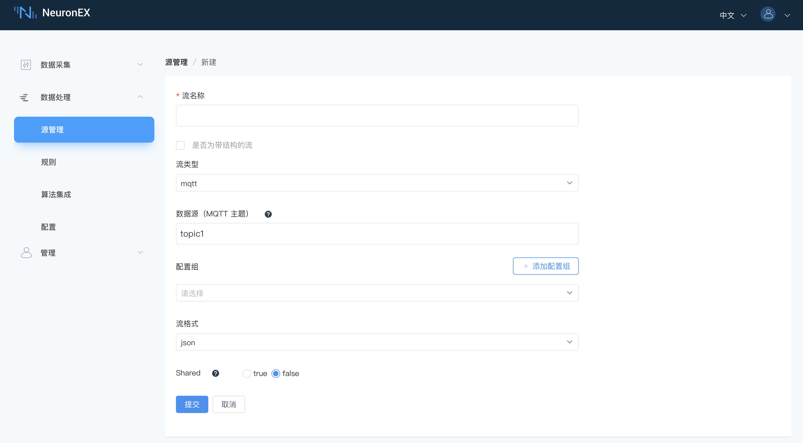

# 流管理

流是 NeuronEX 中数据源连接器的运行形式，用户可通过指定源类型来定义如何连接到外部资源。流的作用就像规则的触发器，每个事件都会触发规则中的计算。

## 流数据源

目前内置支持以下流类型： 

| 名称                        | 描述                                       |
| --------------------------- | ------------------------------------------ |
| [MQTT](./mqtt.md)           | 从 MQTT 主题读取数据                       |
| [HTTP pull](./http_pull.md) | 从 HTTP 服务器中拉取数据                   |
| [HTTP push](./http_push.md) | 通过 HTTP 推送数据到 NeuronEX              |
| [内存](./memory.md)         | 从 NeuronEX 内存主题读取数据以形成规则管道 |
| [Neuron](./neuron.md)       | 从NeuronEX的数采引擎模块读取数据                 |
| [文件](./file.md)           | 从文件中读取数据                           |
| [SQL](./redis.md)         | 从数据库中查询数据                        |
| [Video](./video.md)         | 从视频流中查询数据                        |

## 创建流

在 NeuronEX 页面，点击**数据流处理** -> **源管理**，在流管理页面，点击**创建流**按钮即可进行流的创建。



### 流参数配置


- **是否为带结构的流**

NeuronEX 支持带结构/无结构的流，默认为无结构。用户无需定义任何形式的 schema，主要用于弱结构化数据流，或数据结构经常变化的情况。详细说明请参考[数据结构](#数据结构)。

- **流类型**

NeuronEX 支持多种流类型，具体可参考 [流数据源](#流数据源)。

- **数据源**

取决于不同的数据源类型；如果是 MQTT 源，则为 MQTT 数据源主题名；其它源请参考相关文档。

- **配置组**

定义各类型数据源的相关配置项，具体可参考相关文档，每个数据源均提供了 default 配置组，可供参考。

- **流格式**

  用于定义传入的数据类型，支持 `json`、`protobuf`、`binary`、`delimited` 和 `custom`，默认为 `JSON` 。该属性是否生效取决于源的类型，某些源自身解析的时固定私有格式的数据，则该配置不起作用。以下为其中部分流格式的介绍：

  - delimited
  如选择 delimited 格式，还应指定分隔符来区分数据字段，如 ","

  - protobuf
  
  Protobuf 是一种序列化结构数据的方式，它更加简洁高效，能够实现数据的高效序列化。这种二进制格式的消息更小，更快，同时也更简单。当流格式设置为 protobuf 时，还应配置解码时使用的模式。模式可在 数据流处理 -> 配置 -> 模式定义。有关模式的详细介绍，见 [模式](./config.md#模式)。

  - Binary
  对于二进制数据流，例如图像或者视频流，需要指定数据格式为 "BINARY" 。

<!-- ### 时间戳与时间戳格式

时间戳代表该事件的时间戳。如设置，则使用此流的规则将采用事件时间；否则将采用处理时间。

时间戳格式为字符串和时间格式转换时使用的默认格式。 -->

- **共享 (SHARED)**

默认情况下，`SHARED` 属性设置为 `false` ，每个规则会创建自己的源实例。通过配置共享源实例，用户可以确保两个规则处理完全相同的数据。同时，由于节省了额外的源实例开销，规则的性能也能得到提升。使用共享源实例模式，只需要共享源实例的流时，将其 `SHARED` 属性设置为 `true` 。

::: tip 提示
在某些场景中，用户需要不同的规则处理完全相同的数据流。例如，在处理传感器的温度数据时，用户可能需要一个规则，当一段时间的平均温度大于30度时触发警告；而另一个规则则是当一段时间的平均温度小于 0 度时触发警告。使用默认配置时，两个规则各自独立实例化源实例。由于网络延迟等原因，规则可能得到不同顺序，甚至各有缺失数据的数据流，从而在不同的数据维度中计算平均值。通过配置共享源实例，用户可以确保两个规则处理完全相同的数据。
:::

### 数据结构

NeuronEX 支持带结构/无结构的流，默认为无结构。用户无需定义任何形式的 schema，主要用于弱结构化数据流，或数据结构经常变化的情况。

- 无结构的流 

Schemaless，用户无需定义任何形式的 schema，主要用于弱结构化数据流，或数据结构经常变化的情况。

- 带结构的流

用户在 source 层定义 schema，多用于弱类型的编码方式，例如最常用的 JSON。适用于用户的数据有固定或大致固定的格式，同时不想使用强类型的数据编解码格式。使用这种方式的情况下，可通过 StrictValidation 参数配置是否进行数据验证和转换。若数据格式完好，建议关闭验证。

   此时，用户需指定流字段类型，目前 NeuronEX 支持以下字段类型：

   | #    | 数据类型 | 说明                                                         |
   | ---- | -------- | ------------------------------------------------------------ |
   | 1    | bigint   | 整数型。                                                     |
   | 2    | float    | 浮点型。                                                     |
   | 3    | string   | 文本值，由 Unicode 字符组成。                                |
   | 4    | datetime | 日期时间类型。                                               |
   | 5    | boolean  | 布尔类型，值可以是`true` 或者 `false`。                      |
   | 6    | bytea    | 用于存储二进制数据的字节数组。如果在格式为 "JSON" 的流中使用此类型，则传入的数据需要为 base64 编码的字符串。 |
   | 7    | array    | 数组类型可以是任何简单类型，数组类型或结构类型。             |
   | 8    | struct   | 复杂类型。                                                   |


## 示例

**示例1**

```sql
my_stream 
  (id bigint, name string, score float)
WITH ( datasource = "topic/temperature", FORMAT = "json", KEY = "id");
```

该流将订阅 MQTT 主题`topic/temperature`，服务器连接使用配置文件`$ekuiper/etc/mqtt_source.yaml` 中默认部分的 server 键。

**示例2**

```sql
demo (
		USERID BIGINT,
		FIRST_NAME STRING,
		LAST_NAME STRING,
		NICKNAMES ARRAY(STRING),
		Gender BOOLEAN,
		ADDRESS STRUCT(STREET_NAME STRING, NUMBER BIGINT),
	) WITH (DATASOURCE="test/", FORMAT="JSON", KEY="USERID", CONF_KEY="demo");
```

流将订阅 MQTT 主题 `test/`，服务器连接使用配置文件`$ekuiper/etc/mqtt_source.yaml` 中 demo 部分的设置。

**示例3**

```sql
demo () WITH (DATASOURCE="test/", FORMAT="protobuf", SCHEMAID="proto1.Book");
```

流将订阅 MQTT 主题 `test/`，使用 PROTOBUF 格式，根据在 `$ekuiper/data/schemas/protobuf/schema1.proto` 文件中的 `Book` 定义对流入的数据进行解码。其中，模式的管理详见 [模式](./config.md#模式)。


